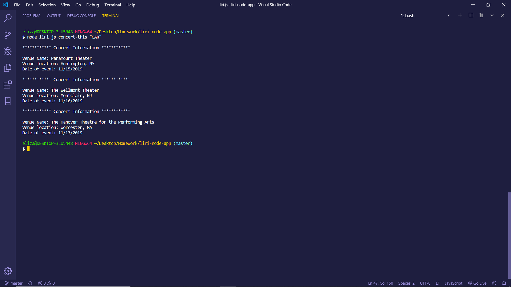
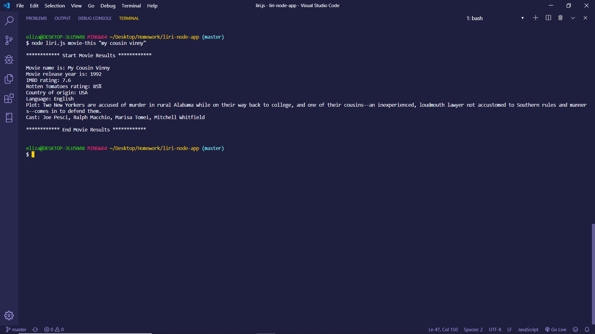
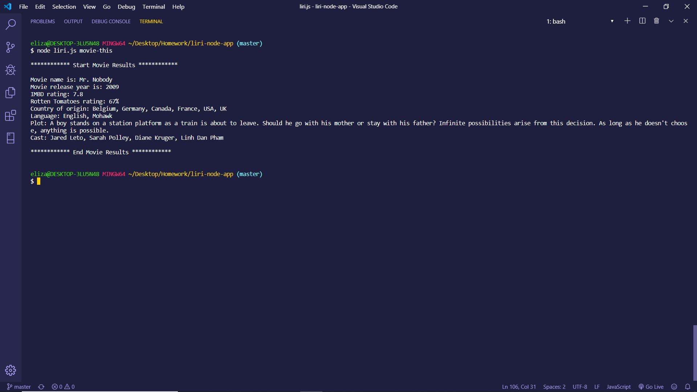
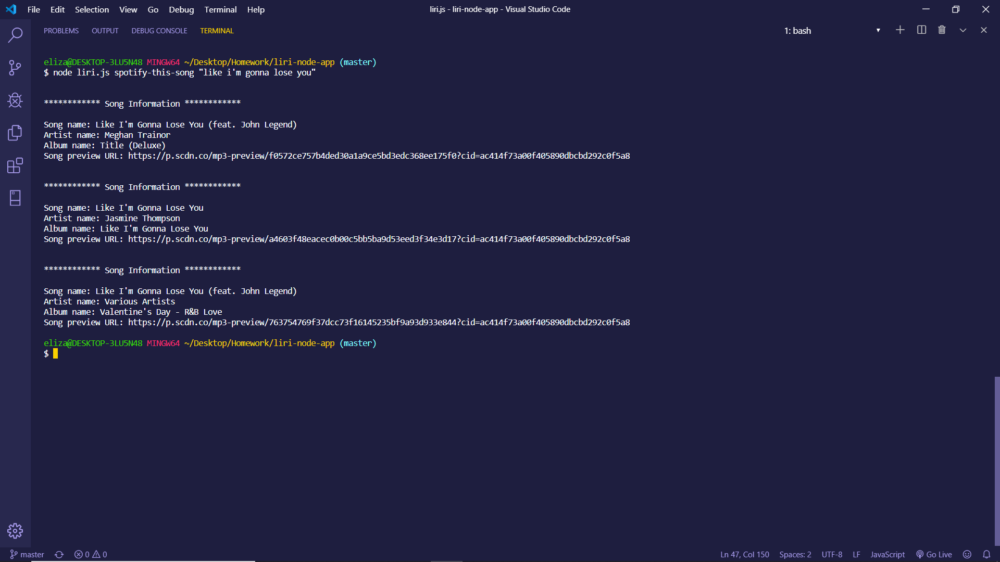
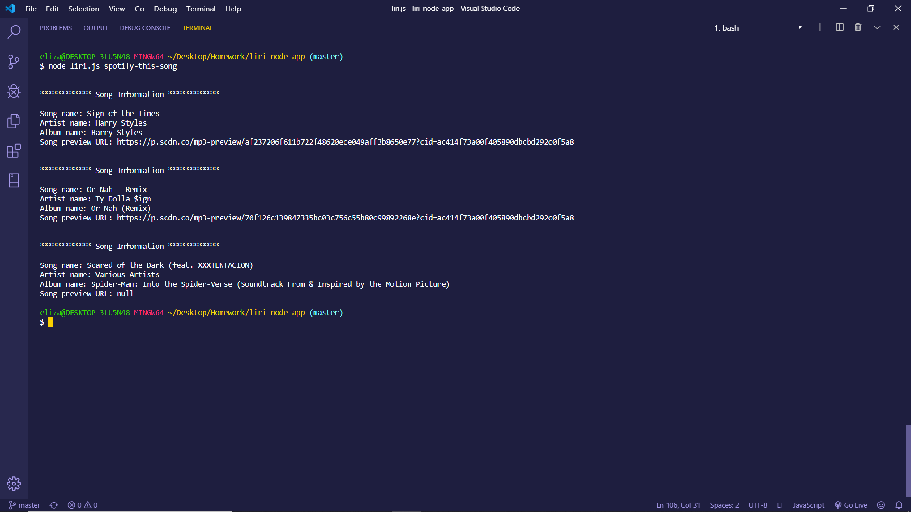
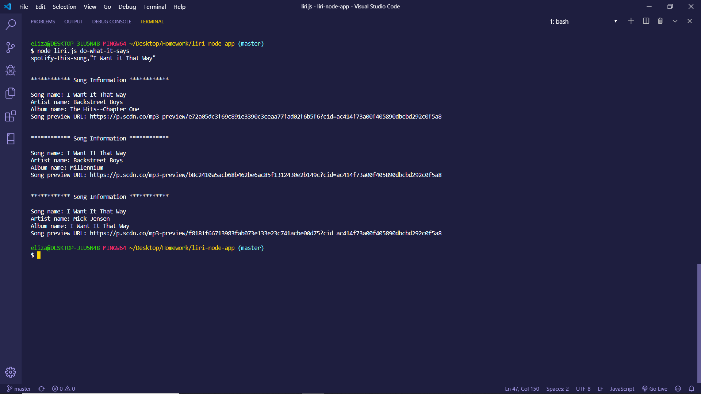

 
 # LIRI NODE APP
 
 **_Liri_** is a language interpretation and recognition interface that is brought to life using the command line.  This app uses the Spotify API, OMDB API and Bands In Town API to display information about movies, bands, artists, concerts, and music.  The user has the option of using four commands (listed below) in conjuntion with specific parameters associated with the commands. The commands are:

 * concert-this

 * spotify-this-song

 * movie-this

 * do-what-it-says
 
 [**Click here for a demo of _Liri_ in action**](https://youtu.be/y0QbWPcYGxo)
 
 ## Getting Started 

Below you will find a guide to help you get started and teach you how to run **_Liri_**

### Prerequisites

  1. NodeJS - **_Liri_** is a node application that requires node to be installed in order to run.
  
### Installing

  1. Use the following link to install node
  [Link to NodeJS](https://nodejs.org/en/)
 
### Bring Liri to Life/Getting Started

1. Open your preferred terminal
2. Navigate to the folder that contains the ```liri.js``` file
3. The output will vary depending on the command you run. 

   **Example 1:** Run the ```concert-this``` command
   
   ``` 
   node liri.js concert-this <"name of artist or band"> 
   ```
   Output: The system will display a list of the next 3 events, dates of events and            locations of events where the artist or band will performing.
   
   

   
   **Example 2:** Run the ```movie-this``` command 
   
   ```
   node liri.js movie-this <"name of movie">
   ```
   Output: The system will display the Title, Release Year, IMDB Rating, Rotten Tomatoes      Rating, Country or Production, Language, Plot and Actors associated with the movie. If no specific movie is defined after ```spotify-this-song``` command, it will display results for "Mr Nobody" as default movie.
   
   **Displayig Results For The Movie "My Cousin Vinny" Being Searched By User**
   
   
   **Displaying Results For Default Movie - "Mr Nobody"**
   
   
   **Example 3:** Run the ```spotify-this-song``` command 
   
   ```
   node liri.js spotify-this-song <"name of song"> 
   ```
   Output: The system will display 3 song names that best match the search criteia.  It        will also display the artist(s) name, a link to preview the song, and the album the song    is on. If no specific song is defined after ```spotify-this-song``` command, it will display results for "The Sign" as default song.   
   
   **Displaying Results For Song "Like I'm Gonna Lose You" Being Searched By User**
   
   
   **Displaying Results For Default Song - "The Sign"**
   
   
   **Example 4:** Run the ```do-what-it-says``` command
   
   ```
   node liri.js do-what-it-says
   ``` 
   Output: The system will read the text in the random.txt file and execute the command        listed in the random.txt file.
   
   
 
### Built With 
  - JavaScript
  - NodeJS
  - Axios NPM
  - VSC Terminal
  - Git Bash
  - Dot-env NP
  - Spotify API
  - Node-spotify-api NPM
  - OMDB API
  - OMDB NPM Module
  - Bands In Town API
  - Bands In Town NPM
  - Moment NPM

### Author 
 - Elizabeth Clohosey
    - [Git Hub Profile](https://github.com/ElizabethClohosey)
    - [LinkedIn Profile](https://www.linkedin.com/in/elizabeth-clohosey-r-t-r-m-arrt-10233a185/)
    
### Helpful Links
  - [NodeJs Link](https://nodejs.org/en/)
  - [Dot-env NPM Link](https://www.npmjs.com/package/dotenv)
  - [Axios NPM](https://www.npmjs.com/package/axios)
  - [Spotify API](https://developer.spotify.com)
  - [Node-Spotify-API Module](https://www.npmjs.com/package/spotify)
  - [OMDB API](http://www.omdbapi.com)
  - [OMDB NPM Module](https://www.npmjs.com/package/omdb)
  - [Band In Town API](https://artists.bandsintown.com/login)
  - [Bands In Town NPM Module](https://www.npmjs.com/package/bandsintown-rest)
  - [Moment NPM Module](https://www.npmjs.com/package/moment)
  
   [**Click here for a demo of _Liri_ in action**](https://youtu.be/y0QbWPcYGxo)
